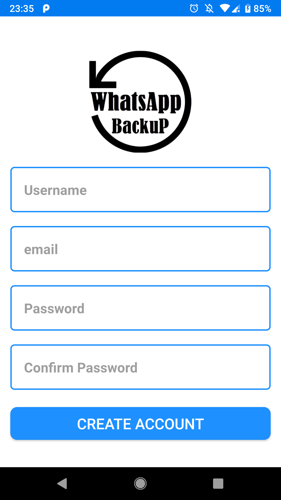
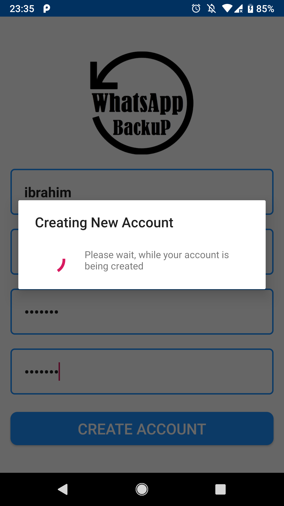
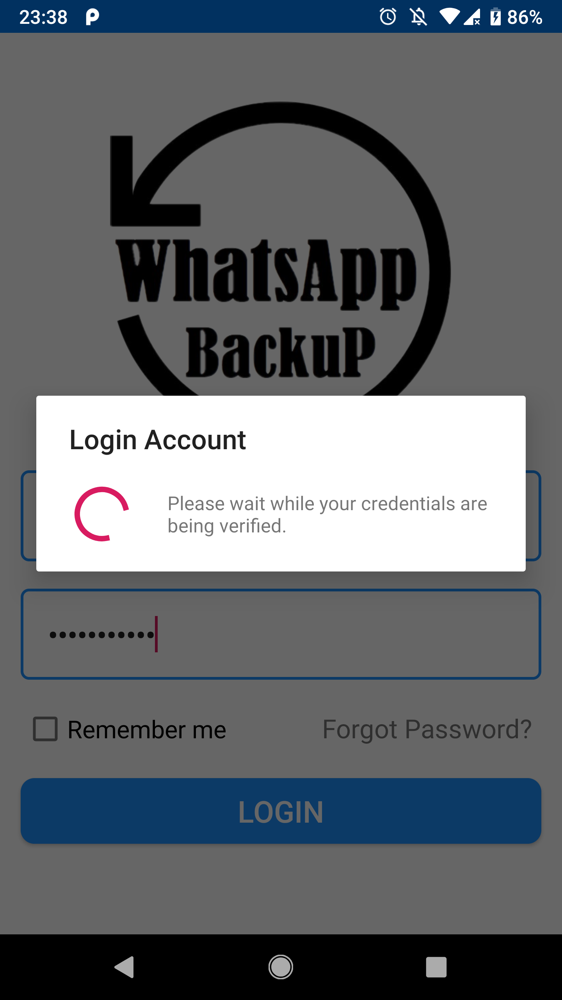
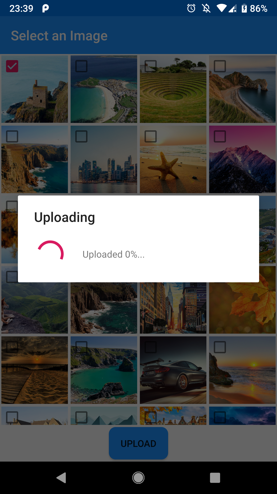
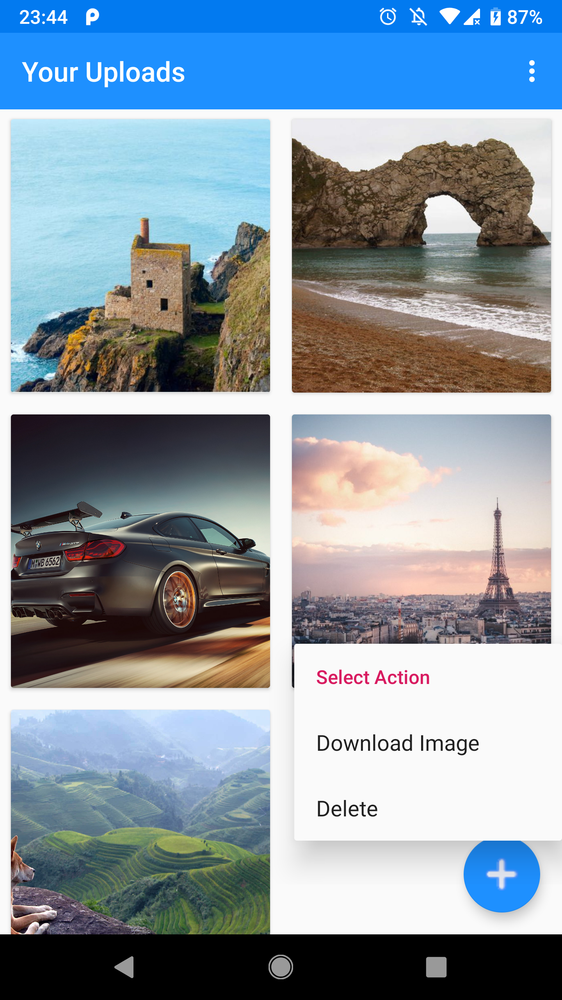
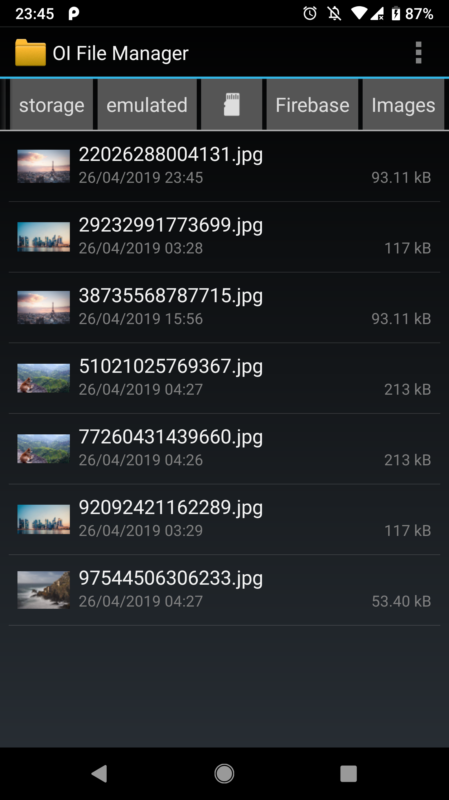
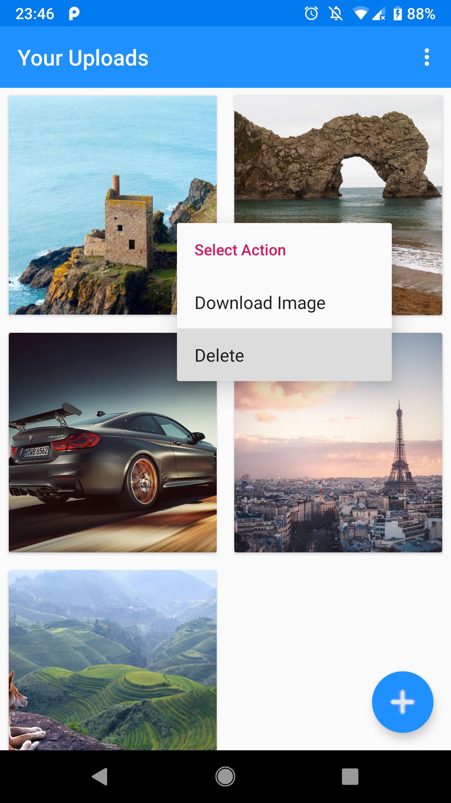
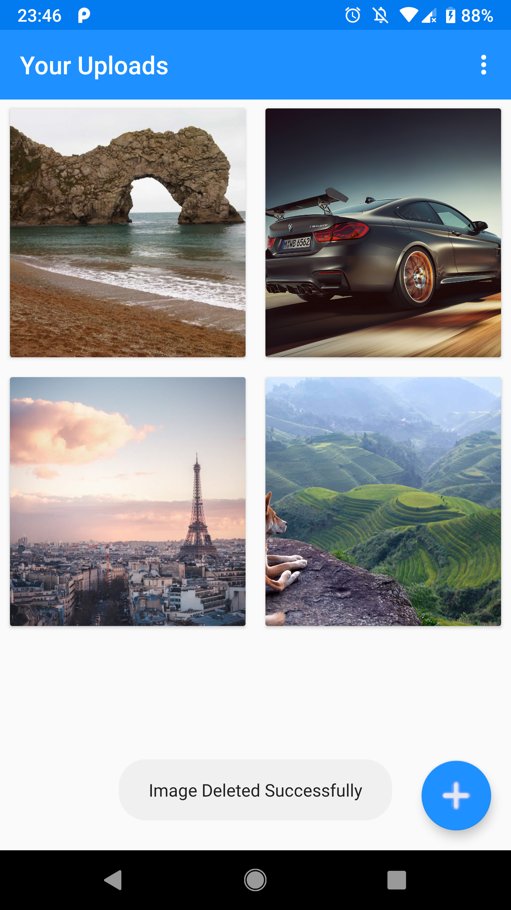

# WhatsApp-Image-Backup
Android Image Backup application to backup WhatsApp images to the cloud and be able to view the images with the app or download them on your android device.

     

     

    
